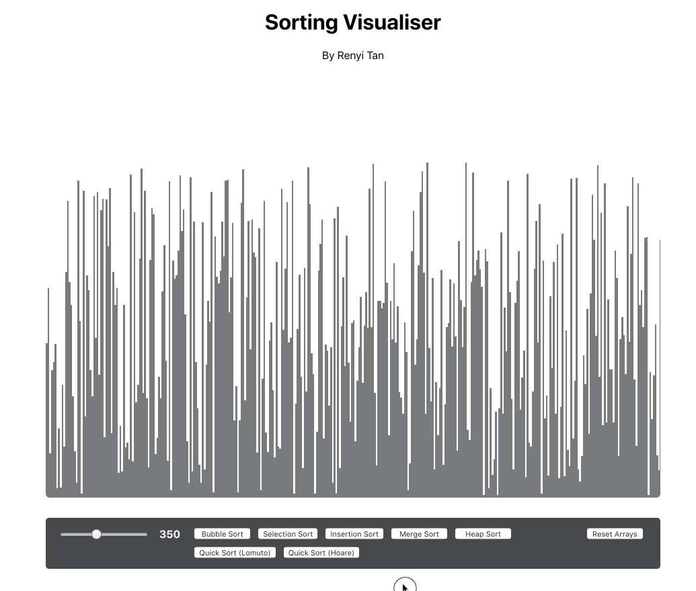

## Sorting Visualiser
Written in Javascript on React CRA

<kbd>

</kbd>

<br>
To run, use the following command: 


```js
npm install // get all the dependencies
npm start
```

### Sorting Algorithms
This are a list of sorting algorithms currently being implemented: 

- Bubble Sort [O(n<sup>2</sup>)]
- Insertion Sort [O(n<sup>2</sup>)]
- Merge Sort [O(n log n)]
- Heap Sort [O(n log n)]
- Quicksort (with Lomuto Partition Scheme) [O(n log n)]
- Quicksort (with Hoare Partition Scheme) [O(n log n)]

### Working Principles
To find out more about the working principles of the implementation, click [here](https://github.com/renyitan/sorting_visualiser/tree/master/src/app). 
